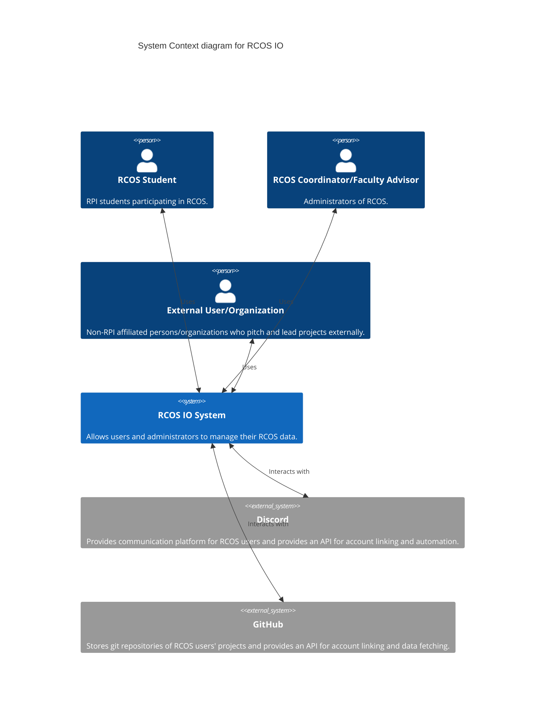
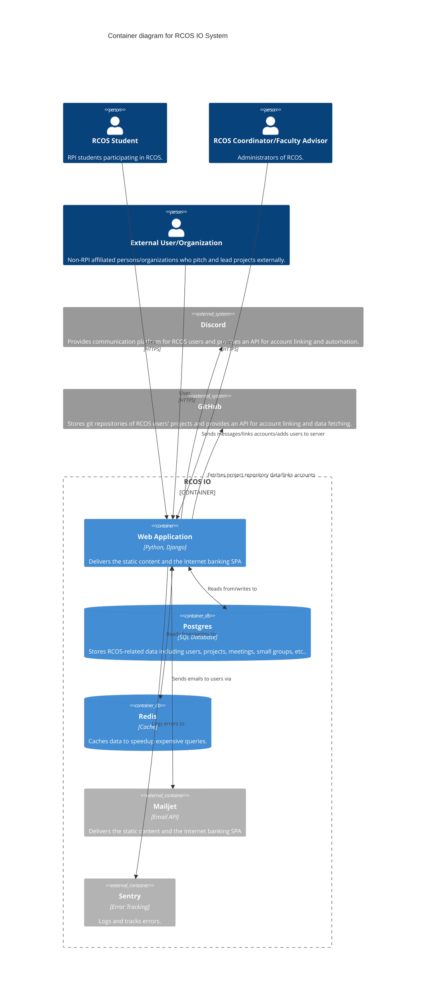

# RCOS IO

RCOS IO is the latest iteration of an admin and member portal for the Rensselaer Center for Open Source. It was created by Coordinators in 2022 and will be maintained by alumnus Frank Matranga until at least 2028, solving the issue of loss of experience as student leadership comes and goes.

## Motivation

RCOS has to handle the data of typically 350+ students each semester. Data includes enrolled students, external organizations and their users, projects, semester enrollments, meetings, mentors, small groups, etc. Most of the operations are straightforward CRUD operations (Create Read Update Destroy) and the data does not often change. As a result, a traditional web application using a relational database is a good choice. Django was chosen because it is batteries-included and opinionated, and Python is a very well-known and accessible language to develop and deploy. Currently the site, database, and cache are hosted at the cost of a few dollars a month on [Railway](https://railway.app).

## Stack

- Python [Django](https://www.djangoproject.com/) backend
- Plain old HTML frontend using
    - [Bulma CSS library](https://bulma.io/documentation/)
- [PostgreSQL](https://www.postgresql.org/) database
- [Redis](https://redis.io/) cache

## Local Development

### Requirements

- >= Python 3.11
- [uv](https://docs.astral.sh/uv/getting-started/installation/)

### Setup

1. Clone repository
2. Install dependencies `uv sync`
3. Create a `.env` file (not the placement of the `.`) and add environment values
    - see `.env.example` for the expected variables
4. Setup database `uv run ./manage.py migrate` OR ask maintainers for test data DB file
5. Setup cache table in database `uv run ./manage.py createcachetable`
6. Create a superuser for testing `uv run ./manage.py createsuperuser`

### Running

1. `uv run ./manage.py runserver`
2. Navigate to http://127.0.0.1:8000/auth/login/ and enter the email of your superuser and choose "Login (admin)"

## Deploying to Production

1. `git push origin main:production`

## Updating Dependencies

We use [MEND Renovate](https://www.mend.io/renovate/) to automatically open dependency update PRs.

# Architecture Diagrams

(Best viewed on GitHub)

